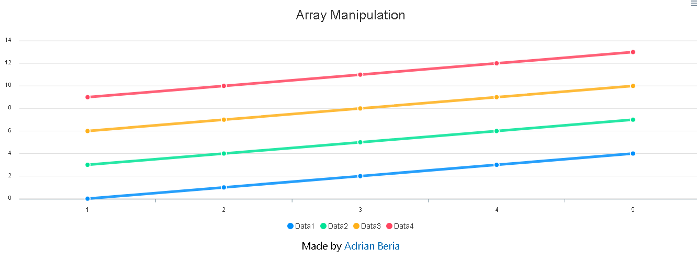

# React Array Manipulation

> Run your client with a single command

## Quick Start

``` bash
# Install dependencies for client
yarn install

# Run your app
yarn start

# Client on http://localhost:3000
```

## Folder Distribution

The workflow I currently use is as follows:

- public
    - index.html 
- src
    - components
        ContainerChart.js
    - App.js

## What is this app about

We're creating an application that graphs a random set of data. The idea of this project was to show how to manipulate a JSON to obtain the data we wanted. Check more information on my [blog](https://radinax.github.io/React-Personal-Blog-Gatsby/6-second-project/)




Check it live [here](http://abhorrent-metal.surge.sh/).

We make use of Create-React-App for a quick setup, then we install **Apex Charts** which is great library for displaying data through different types of Charts and is compatible with React JS. 

The structure of the Library looks like this:

```
 options: {
              chart: {
                  //background: '#f4f4f4',
              foreColor: '#333'
              },
              xaxis: {
                  categories: []
              },
              fill: {
                  colors: ['#f44336']
              },
              dateLabels: {
                  enabled: false
              },
              title: {
                  text: 'Bitcoin Price Chart',
                  align: 'center',
                  margin: 20,
                  offsetY: 20,
                  style: {
                      fontSize: '25px'
                  }
              }
            },
            series: [{
                name: 'Numbers',
		            data: []
            }]
        }
```

The two important parts of this structure are **categories** where the data related to the X axis is going to be at, and **data** which is an empty array for now as well as categories which is where the Bitcoin price is going to be located.

Finally we make use of the **Chart** component from **react-apexcharts**:

```
<Chart 
    options = {this.state.options}
    series = {this.state.series}
    type="line"
    height= "450"
    width= "100%"
/>
```
## Closure

This app was mainly for education purpose to show how to manipulate data using Object.key, Object.value and .map to get the data we want which can be hard for people starting out.

**Made by Adrian Beria.**

**Web Developer.**
